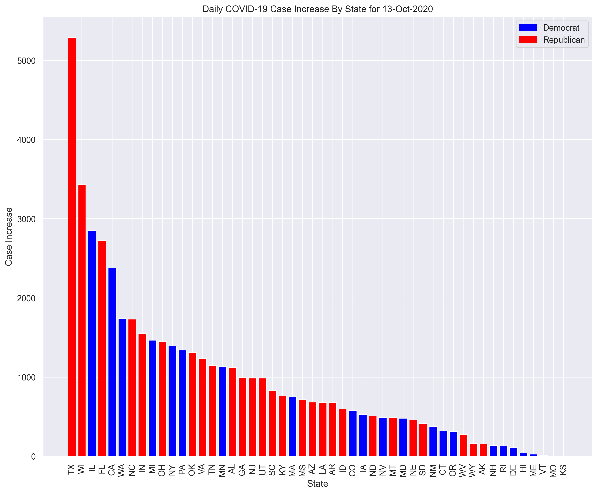

# Daily COVID-19 Cases By State and Political Affiliation

This is a Jupyter notebook which obtains the daily increase in cases for each state via the COVID Tracking Project API and sorts the states by case number and differentiates them based on political affiliation determined by previous election results.

